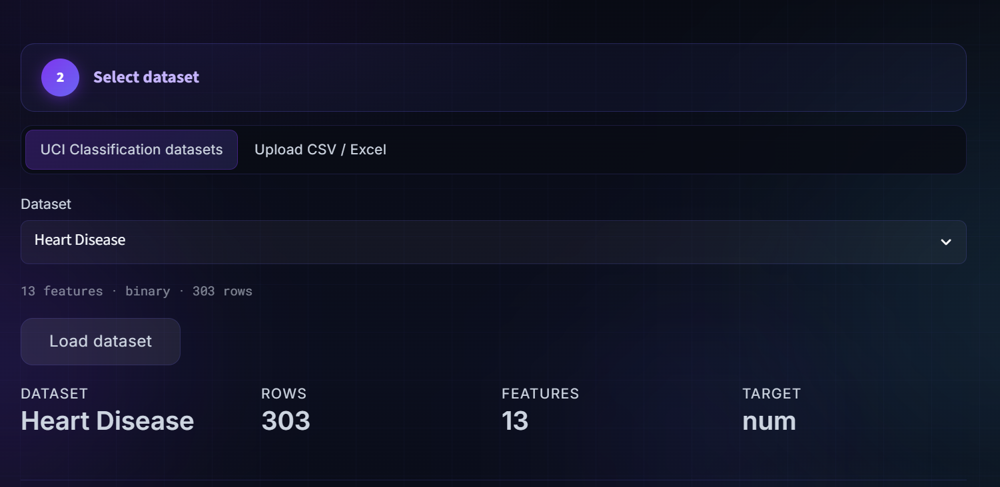
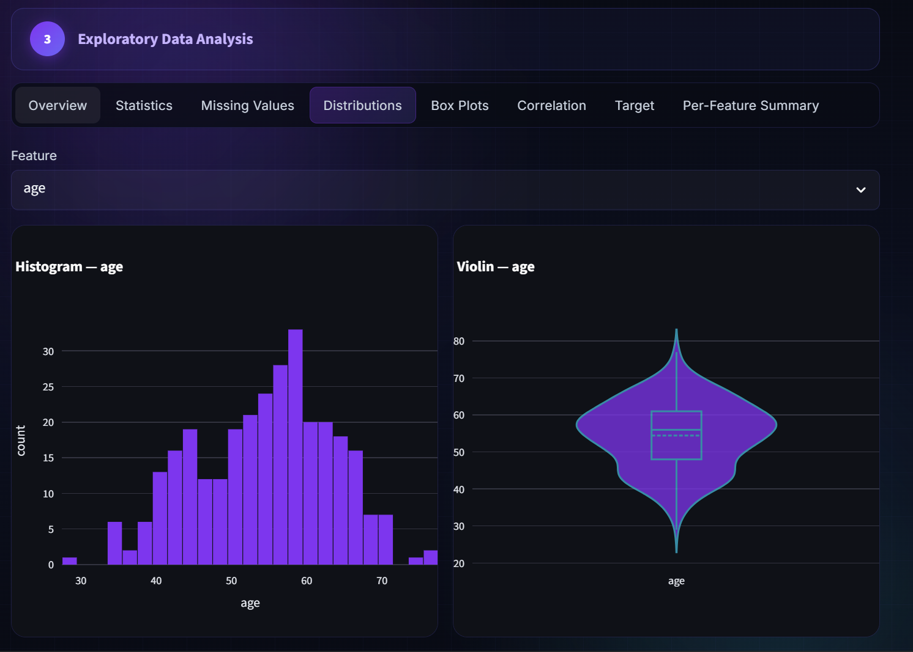
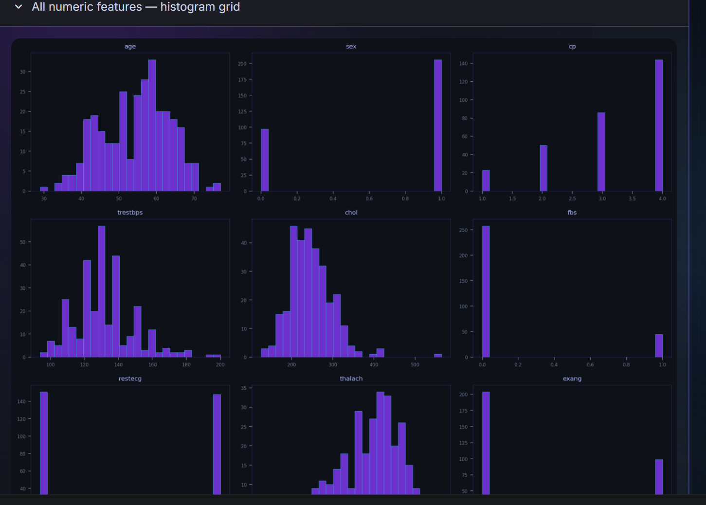
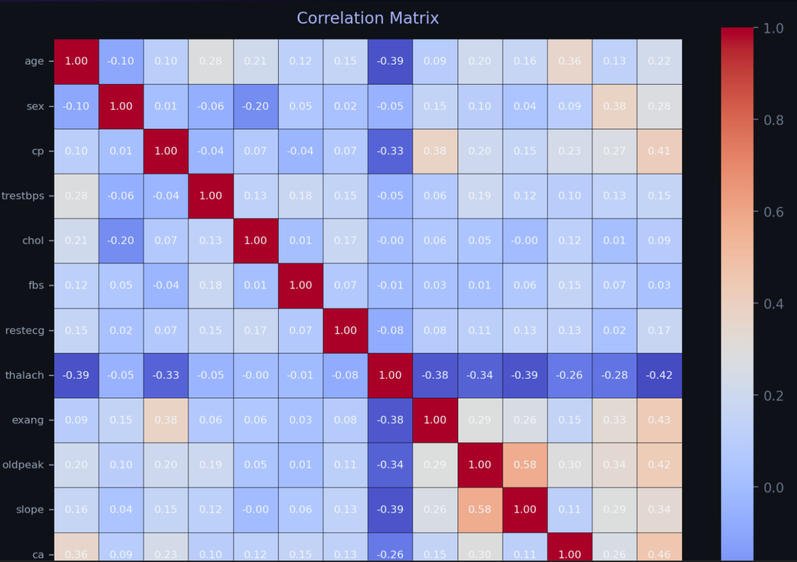
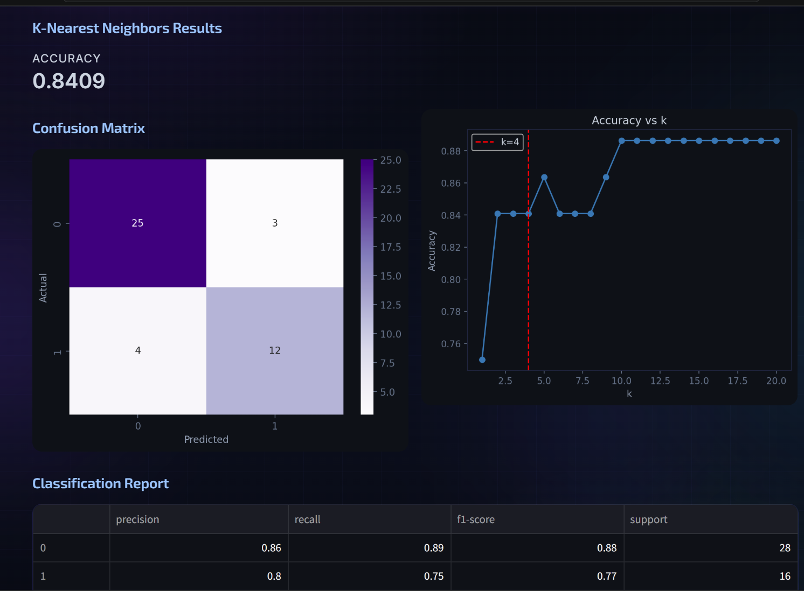
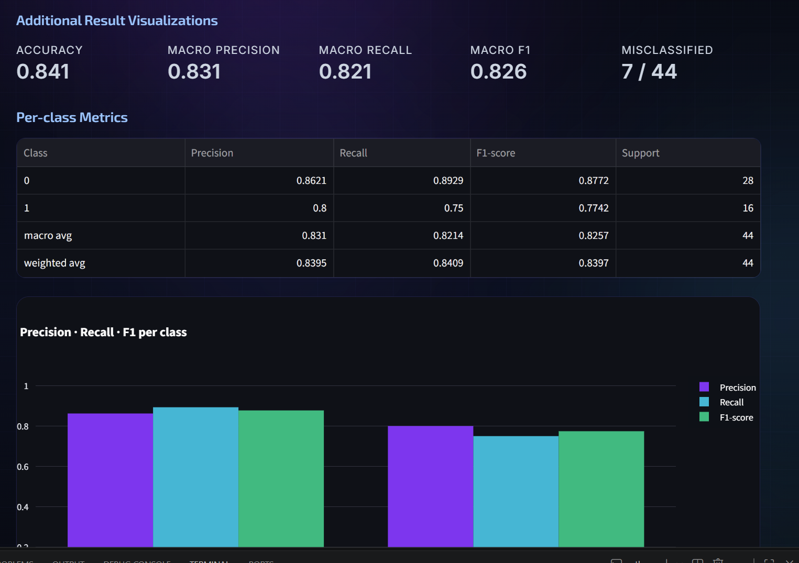
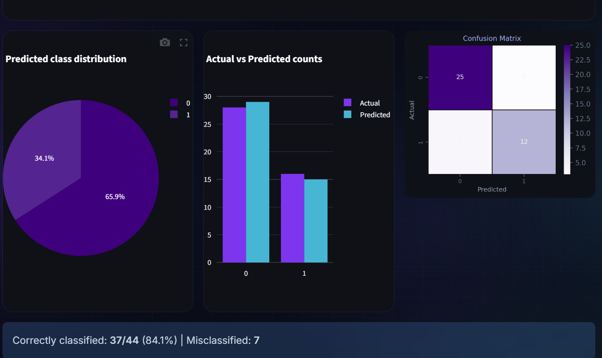
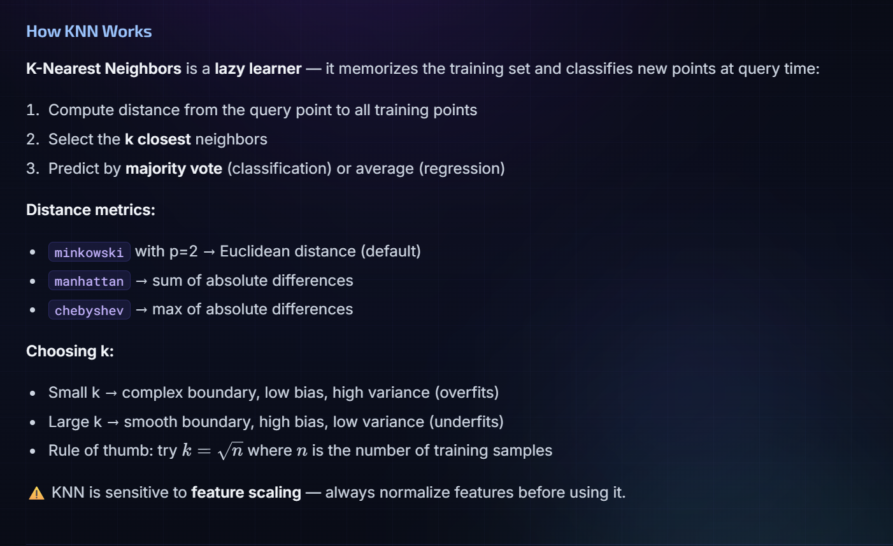

# LucidLabs — Learn Machine Learning by Doing It
demo live at https://lucidlabs-jinvswjyw3b3ralpnzbsut.streamlit.app/

> An interactive ML education platform built with Streamlit. Upload a dataset, auto-detect the task, explore your data, clean it, train any of 11 algorithms with tunable hyperparameters, and get an in-depth explanation of how the model works — all in one app, no code required.


---

## Table of Contents

- [What This App Does](#what-this-app-does)
- [App Flow (6 Steps)](#app-flow-6-steps)
- [Classification Models](#classification-models-9)
- [Regression Models](#regression-models-6)
- [EDA Dashboard (8 Tabs)](#eda-dashboard-8-tabs)
- [Data Cleaning & Preprocessing](#data-cleaning--preprocessing)
- [Built-in Datasets](#built-in-datasets)
- [Results & Visualizations](#results--visualizations)
- [Tech Stack](#tech-stack)
- [Project Structure](#project-structure)
- [Installation](#installation)

---

## What This App Does

LucidLabs is not a single-script model trainer. It is a full end-to-end ML pipeline with an educational layer on top:

- Accepts **8 built-in UCI datasets** or any user-uploaded CSV/Excel file
- **Auto-detects** whether the task is Classification or Regression
- Runs a full **8-tab EDA dashboard** with interactive visualizations
- Provides a configurable **data cleaning and preprocessing pipeline** (imputation, outlier removal, encoding, scaling)
- Lets you pick from **11 algorithms** and tune their hyperparameters via sliders and dropdowns
- Shows rich **metrics and visualizations** after training
- Explains exactly **how each algorithm works** with illustrations and math

---

## App Flow (6 Steps)

### Step 1 — Choose Your Task

Select whether you want to solve a **Classification** or **Regression** problem. This drives every subsequent choice in the app — which datasets appear, which models are available, and which metrics are shown.


---

### Step 2 — Select or Upload a Dataset

Pick from a built-in UCI dataset or upload your own CSV/Excel file and choose the target column.



---

### Step 3 — Explore Your Data (EDA)

Eight interactive tabs give you a complete picture of your dataset before you touch the model.





---

### Step 4 — Clean & Preprocess

Configure exactly how missing values, outliers, categorical columns, and feature scales are handled. A full cleaning report shows what changed.


---

### Step 5 & 6 — Choose, Configure & Train

Select a model, tune its hyperparameters, set your train/test split, and hit Train.


---

### Results

Metrics, visualizations, and a deep-dive explanation of your chosen algorithm.






---

## Classification Models (9)

### 1. Logistic Regression
Uses the sigmoid function to map a linear combination of features to a probability between 0 and 1. The decision boundary is where that probability equals 0.5.

| Hyperparameter | Range | Default | Effect |
|---|---|---|---|
| `C` (regularization strength) | 0.01 – 10.0 | 1.0 | Lower = more regularization, reduces overfitting |
| `max_iter` | 100 – 1000 | 200 | Maximum solver iterations |

**Metrics:** Accuracy, ROC-AUC (binary), Confusion Matrix, Classification Report

---

### 2. Random Forest Classifier
An ensemble of decision trees trained on bootstrapped subsets of the data. Final prediction is a majority vote across all trees.

| Hyperparameter | Range | Default | Effect |
|---|---|---|---|
| `n_estimators` | 10 – 300 | 100 | Number of trees; more = better but slower |
| `max_depth` | None, 3 – 20 | None | Maximum depth per tree; None = fully grown |

**Metrics:** Accuracy, Confusion Matrix, Feature Importances, Classification Report

---

### 3. Gradient Boosting Classifier
Builds trees sequentially, where each tree corrects the residual errors of the previous one. Uses a learning rate to shrink each tree's contribution.

| Hyperparameter | Range | Default | Effect |
|---|---|---|---|
| `n_estimators` | 50 – 500 | 100 | Number of boosting stages |
| `learning_rate` | 0.01 – 0.5 | 0.1 | Shrinkage applied to each tree |
| `max_depth` | 1 – 8 | 3 | Depth of each individual tree |
| `subsample` | 0.5 – 1.0 | 1.0 | Fraction of samples used per tree |

**Metrics:** Accuracy, Confusion Matrix, Feature Importances, Classification Report

---

### 4. AdaBoost Classifier
Assigns higher weights to misclassified samples in each round so subsequent weak learners focus on hard examples. Final prediction is a weighted vote.

| Hyperparameter | Range | Default | Effect |
|---|---|---|---|
| `n_estimators` | 10 – 300 | 50 | Number of weak learners |
| `learning_rate` | 0.01 – 2.0 | 1.0 | Weight applied to each weak learner |
| `max_depth` (base estimator) | 1 – 5 | 1 | Depth of the base decision stump |

**Metrics:** Accuracy, Confusion Matrix, Feature Importances, Estimator Weights, Classification Report

---

### 5. Support Vector Machine (SVC)
Finds the maximum-margin hyperplane that separates classes. The kernel trick maps data into higher-dimensional spaces where linear separation is possible.

| Hyperparameter | Range | Default | Effect |
|---|---|---|---|
| `C` | 0.01 – 10.0 | 1.0 | Margin width vs. misclassification penalty |
| `kernel` | rbf / linear / poly | rbf | Decision boundary shape |
| `gamma` | scale / auto | scale | Influence radius of each support vector |

**Metrics:** Accuracy, Confusion Matrix, Classification Report

---

### 6. K-Nearest Neighbors (KNN)
A lazy learner — stores training data and classifies new points by majority vote among the K closest neighbors using a chosen distance metric.

| Hyperparameter | Range | Default | Effect |
|---|---|---|---|
| `k` (n_neighbors) | 1 – 20 | 5 | Neighborhood size; higher = smoother boundary |
| `weights` | uniform / distance | uniform | Uniform vote vs. distance-weighted vote |
| `metric` | minkowski / euclidean / manhattan | minkowski | Distance function |

**Metrics:** Accuracy, Confusion Matrix, Classification Report, K vs. Accuracy curve

---

### 7. Decision Tree Classifier
Splits data recursively on the feature that maximizes information gain (Entropy) or purity (Gini). Produces an interpretable tree structure.

| Hyperparameter | Range | Default | Effect |
|---|---|---|---|
| `max_depth` | 1 – 15 | 5 | Limits tree depth to prevent overfitting |
| `criterion` | gini / entropy | gini | Splitting criterion |
| `min_samples_split` | 2 – 20 | 2 | Minimum samples needed to split a node |

**Metrics:** Accuracy, Confusion Matrix, Feature Importances, Tree Visualization (depth ≤ 4), Classification Report

---

### 8. Naive Bayes
Applies Bayes' theorem with a strong (naive) conditional independence assumption between features. Fast and effective especially with small datasets and high-dimensional inputs.

| Variant | Best For | Hyperparameter |
|---|---|---|
| Gaussian (default) | Continuous features | `var_smoothing` (1e-12 – 1e-6, default 1e-9) |
| Bernoulli | Binary features | `alpha` (0.01 – 2.0, default 1.0) |
| Multinomial | Count features | `alpha` (0.01 – 2.0, default 1.0) |

**Metrics:** Accuracy, Confusion Matrix, Class Priors, Classification Report

---

### 9. MLP Neural Network (Classifier)
A fully-connected feedforward neural network trained with backpropagation. Supports multiple hidden-layer architectures and activation functions.

| Hyperparameter | Options / Range | Default |
|---|---|---|
| `hidden_layer_sizes` | (100,) / (100,50) / (128,64,32) / (256,128) / (64,) / (200,100,50) | (100,) |
| `activation` | relu / tanh / logistic | relu |
| `solver` | adam / sgd / lbfgs | adam |
| `alpha` (L2 penalty) | 1e-5 – 1.0 | 1e-4 |
| `learning_rate_init` | 1e-4 – 0.01 | 1e-3 |
| `max_iter` (epochs) | 100 – 1000 | 300 |

**Metrics:** Accuracy, Confusion Matrix, Training Loss Curve, Classification Report

---

## Regression Models (6)

### 1. Linear Regression (3 Variants)
Fits a linear relationship between features and target. Ridge and Lasso add regularization to penalize large coefficients.

| Variant | Regularization | Hyperparameter |
|---|---|---|
| OLS | None | — |
| Ridge | L2 (squared penalty) | `alpha` (0.001 – 10.0, default 1.0) |
| Lasso | L1 (absolute penalty, drives sparse weights) | `alpha` (0.001 – 10.0, default 1.0) |

**Metrics:** RMSE, MAE, R², Actual vs Predicted scatter, Residual plot

---

### 2. Random Forest Regressor
Ensemble of regression trees with bagging. Final prediction is the average across all trees.

| Hyperparameter | Range | Default |
|---|---|---|
| `n_estimators` | 10 – 300 | 100 |
| `max_depth` | None, 3 – 20 | None |

**Metrics:** RMSE, MAE, R², Feature Importances, Actual vs Predicted, Residual plot

---

### 3. Gradient Boosting Regressor
Sequential boosting fitting each tree to the negative gradient (residuals) of the loss function of previous trees.

| Hyperparameter | Range | Default |
|---|---|---|
| `n_estimators` | 50 – 500 | 100 |
| `learning_rate` | 0.01 – 0.5 | 0.1 |
| `max_depth` | 1 – 8 | 3 |
| `subsample` | 0.5 – 1.0 | 1.0 |

**Metrics:** RMSE, MAE, R², Feature Importances, Actual vs Predicted, Residual plot, Training Deviance Curve

---

### 4. AdaBoost Regressor
Adaptive boosting for regression using weighted exponential loss on weak learner predictions.

| Hyperparameter | Range | Default |
|---|---|---|
| `n_estimators` | 10 – 300 | 50 |
| `learning_rate` | 0.01 – 2.0 | 1.0 |
| `max_depth` (base estimator) | 1 – 5 | 1 |

**Metrics:** RMSE, MAE, R², Estimator Weights plot, Actual vs Predicted, Residual plot

---

### 5. Support Vector Regressor (SVR)
Fits a tube of width epsilon around the regression function. Points inside the tube incur no penalty; points outside are penalized proportional to their distance from the tube boundary.

| Hyperparameter | Range | Default |
|---|---|---|
| `C` | 0.01 – 10.0 | 1.0 |
| `epsilon` | 0.01 – 1.0 | 0.1 |
| `kernel` | rbf / linear / poly | rbf |
| `gamma` | scale / auto | scale |

**Metrics:** RMSE, MAE, R², Actual vs Predicted, Residual plot

---

### 6. MLP Neural Network (Regressor)
Same fully-connected architecture as the classifier, but with a linear output layer for continuous prediction.

| Hyperparameter | Options / Range | Default |
|---|---|---|
| `hidden_layer_sizes` | (100,) / (100,50) / (128,64,32) / (256,128) / (64,) / (200,100,50) | (100,) |
| `activation` | relu / tanh / logistic | relu |
| `solver` | adam / sgd / lbfgs | adam |
| `alpha` (L2 penalty) | 1e-5 – 1.0 | 1e-4 |
| `learning_rate_init` | 1e-4 – 0.01 | 1e-3 |
| `max_iter` (epochs) | 100 – 1000 | 300 |

**Metrics:** RMSE, MAE, R², Epochs trained, Actual vs Predicted, Training Loss Curve

---

## EDA Dashboard (8 Tabs)

### Tab 1 — Overview
- First and last 10 rows of the dataset
- Column info table: name, dtype, non-null count, unique count
- Numeric vs Categorical feature pie chart (Plotly)

### Tab 2 — Statistics
- Full `.describe()` summary table
- Skewness and Kurtosis table for all numeric columns
- Skewness bar chart with RdBu diverging colorscale

### Tab 3 — Missing Values
- Missing value summary table: column, count, percentage
- Missing value percentage bar chart (Reds colorscale)
- Missing value heatmap for first 100 rows (plasma colormap)

### Tab 4 — Distributions
- Interactive feature selector
- Histogram (30 bins, purple, Plotly)
- Violin plot with box, quartiles, and mean line
- Expandable all-features histogram grid (3-column layout)

### Tab 5 — Box Plots
- Interactive feature selector
- Optional grouping by target class
- Box plot with outlier points visible
- Outlier summary table via IQR method: feature, outlier count, percentage

### Tab 6 — Correlation
- Full correlation matrix heatmap (coolwarm, annotated when ≤ 15 features)
- Feature-to-target absolute correlation bar chart (Purples colorscale)

### Tab 7 — Target
- Class distribution bar chart (Classification) or histogram (Regression)
- Value counts table with describe() statistics
- Violin plot for continuous targets
- Class imbalance warning when majority class > 70%

### Tab 8 — Per-Feature Summary
- Comprehensive table: Feature, Dtype, Non-null, Missing, Unique, Mean, Std, Min, Max, Skewness

---

## Data Cleaning & Preprocessing

### Dataset Health Checks (Auto-Detected)

| Check | What It Detects |
|---|---|
| Missing values | Per-column counts and percentages |
| Duplicate rows | Exact duplicate detection |
| Constant columns | Columns with only 1 unique value |
| High-cardinality columns | Columns with > threshold unique values (configurable 5–100) |
| Negative values | Numeric columns containing negatives |
| Whitespace in strings | Leading/trailing spaces in categorical columns |
| Mixed-type columns | Columns that should be numeric but contain strings |

### Cleaning Operations (User-Configurable)

| Operation | Options |
|---|---|
| Whitespace stripping | On/Off |
| Mixed-type conversion | `pd.to_numeric(errors="coerce")` |
| Constant column removal | On/Off (optionally exclude target) |
| High-cardinality column removal | Threshold configurable (default 20 unique values) |
| Duplicate row removal | On/Off |
| **Missing value imputation** | Fill with Median / Fill with Mean / Fill with Mode / Drop rows / Leave as-is |
| **Outlier removal (IQR)** | None / All numeric columns / Selected columns (1.5 × IQR threshold) |
| **Categorical encoding** | Label Encoding / One-Hot Encoding |
| **Feature scaling** | None / StandardScaler (z-score) / MinMaxScaler (0–1) / RobustScaler (median-based) |

A cleaning report is shown after preprocessing with before/after shapes and a full log of every change applied.

---

## Built-in Datasets

### Classification

| Dataset | UCI ID | Features | Rows | Task |
|---|---|---|---|---|
| Iris | 53 | 4 | 150 | 3-class flower species |
| Heart Disease | 45 | 13 | 303 | Binary cardiac diagnosis |
| Breast Cancer Wisconsin | 17 | 30 | 569 | Binary malignancy detection |
| Banknote Authentication | 267 | 4 | 1,372 | Binary counterfeit detection |

### Regression

| Dataset | UCI ID | Features | Rows | Task |
|---|---|---|---|---|
| Auto MPG | 9 | 7 | 398 | Fuel efficiency prediction |
| Concrete Compressive Strength | 165 | 8 | 1,030 | Structural strength prediction |
| Wine Quality (Red) | 186 | 11 | 1,599 | Wine quality scoring |
| Abalone | 1 | 8 | 4,177 | Age estimation from shell |

All datasets are auto-downloaded via `ucimlrepo`. Custom CSV/Excel uploads are also supported.

---

## Results & Visualizations

### Classification
| Visualization | Description |
|---|---|
| Confusion Matrix | Heatmap of predicted vs actual class counts |
| ROC Curve | True positive rate vs false positive rate with AUC (binary) |
| Classification Report | Per-class precision, recall, F1-score, support |
| Per-class Metrics Bar Chart | Grouped bar chart comparing precision/recall/F1 per class |
| Predicted Class Distribution | Pie chart of predicted label counts |
| Actual vs Predicted Bar Chart | Side-by-side counts for each class |
| Feature Importances | Ranked horizontal bar chart (tree/ensemble models) |
| Tree Visualization | Graphical tree rendering (Decision Tree, depth ≤ 4) |
| Estimator Weights Plot | Weight per boosting round (AdaBoost/Gradient Boosting) |
| Training Loss Curve | Loss vs epochs (MLP only) |

### Regression
| Visualization | Description |
|---|---|
| Actual vs Predicted Scatter | Points around the diagonal identity line |
| Residual Plot | Residuals vs predicted values, zero-line reference |
| Residual Distribution Histogram | Distribution of errors (Plotly, 30 bins) |
| Q-Q Plot | Quantile-quantile plot against normal distribution (requires scipy) |
| Absolute Error vs Actual Scatter | Error magnitude colored by gradient (Reds) |
| Feature Importances | Ranked horizontal bar chart (tree/ensemble models) |
| Training Deviance Curve | Train vs test deviance per boosting stage (Gradient Boosting) |
| Training Loss Curve | Loss vs epochs (MLP only) |

---

## Tech Stack

| Layer | Technology |
|---|---|
| UI Framework | Streamlit |
| Interactive Charts | Plotly 5.x |
| Static Plots | Matplotlib, Seaborn |
| ML Models | scikit-learn |
| Data Handling | pandas, NumPy |
| Statistical Tests | SciPy (Q-Q plots) |
| Dataset Source | ucimlrepo (UCI ML Repository) |
| Excel Upload Support | openpyxl |
| Session Persistence | Streamlit session_state |

---

## Project Structure

```
LucidLabs/
│
├── main.py                    # Landing page (custom HTML, animated hero, stats)
│
├── pages/
│   └── Dashboard.py           # Main 6-step app (EDA → preprocessing → training → results)
│
├── ml_models/                 # One file per algorithm
│   ├── log_reg.py             # Logistic Regression
│   ├── lin_reg.py             # Linear Regression (OLS / Ridge / Lasso)
│   ├── ran_for.py             # Random Forest (Classifier + Regressor)
│   ├── gradient_boost.py      # Gradient Boosting (Classifier + Regressor)
│   ├── adaboost.py            # AdaBoost (Classifier + Regressor)
│   ├── svm.py                 # Support Vector Machine (SVC)
│   ├── svr.py                 # Support Vector Regressor
│   ├── knn.py                 # K-Nearest Neighbors
│   ├── decision_tree.py       # Decision Tree Classifier
│   ├── naive_bayes.py         # Naive Bayes (Gaussian / Bernoulli / Multinomial)
│   └── mlp.py                 # MLP Neural Network (Classifier + Regressor)
│
├── screenshots/               # App screenshots (used in README)
├── requirements.txt
└── README.md
```

---

## Installation

```bash
# Clone the repo
git clone https://github.com/chaitanyayad/LucidLabs.git
cd LucidLabs

# Install dependencies
pip install -r requirements.txt

# Run the app
streamlit run main.py
```

### Requirements

```
streamlit
pandas
numpy
scikit-learn
matplotlib
seaborn
plotly
scipy
openpyxl
ucimlrepo
```
